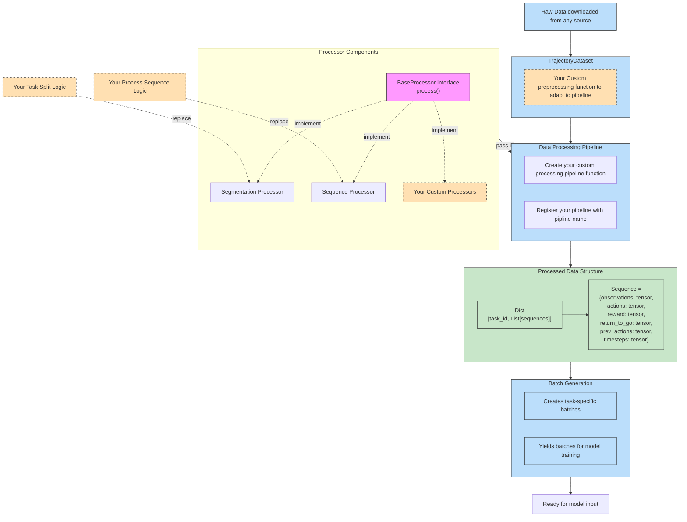
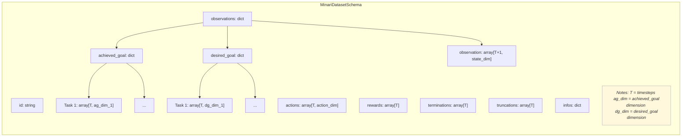
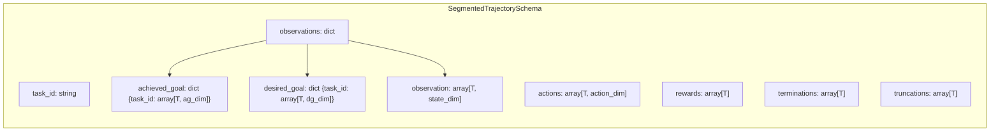
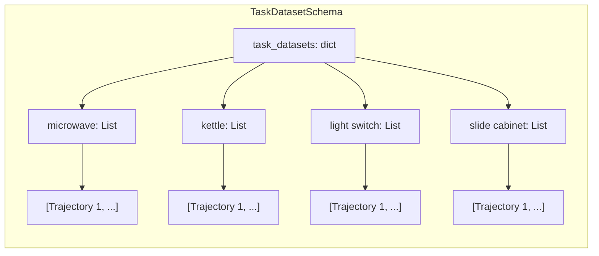
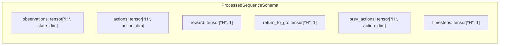
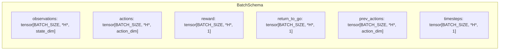

Dataflow:

Minari Kitchen Dataset Schema:

Minari Kitchen dataset schema after task split:

Task Dataset schema:

After we have the above task dataset schema, we will processe the trajectory using sliding window or padding, the data shape for each sequence is:

The data shape for each batch:

